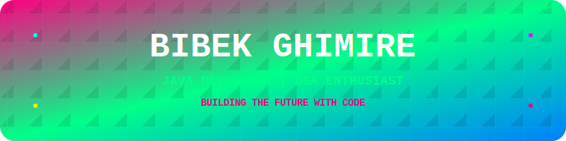

  

  

  
  
  
  

# 🎯 About Me

Hi there! I'm **Bibek Ghimire**, a passionate Java developer and Computer Engineering student based in **Nepal 🇳🇵**. I love building robust backend systems and solving challenging problems with clean, efficient code.

Currently diving deep into **Spring Boot** and **system design** while sharpening my **DSA skills**. My goal is to create impactful software solutions and contribute to the tech community.

When I'm not coding, you'll find me exploring new technologies, gaming, or working on personal projects that push my boundaries.

---

**Currently Learning:** Spring Boot • System Design • Machine Learning • AWS

**2025 Goals:** Build amazing projects • Master Spring ecosystem • Land a remote role

 

## 🌐 Connect with Me

  
  
  
  
  

## 🚀 Tech Stack & Tools

### 💻 Programming Languages

### 🛠️ Frameworks & Libraries

### 🗄️ Databases & Cloud

### 🔧 Tools & Platforms

## 📊 GitHub Analytics

  
  

  

  

## 🏆 GitHub Trophies

  

## 🎯 Current Focus

  

### 📚 Learning Path 2024
- ✅ Core Java Concepts
- ✅ Object-Oriented Programming
- ✅ Basic Data Structures
- 🔄 Spring Boot Framework
- 🔄 Advanced DSA Problems
- 🔄 System Design Fundamentals
- ⏳ Microservices Architecture
- ⏳ Cloud Computing (AWS)

## 💡 Random Dev Quote

  

## 💼 Open for Opportunities

  

  
  

  

---
