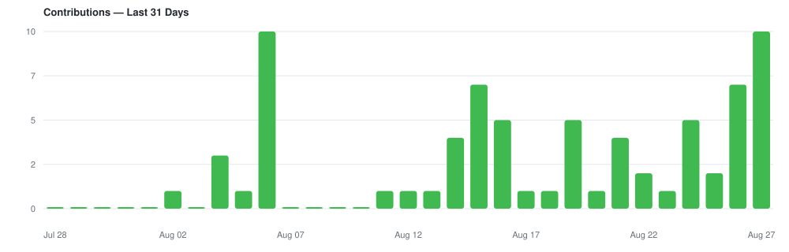

📍Kathmandu, Nepal, 📧bibekghimire773@gmail.com

## Tech Stack

##  Featured Projects

<table width="100%">
<tr>
<td width="100%" valign="top">

### DiGiWallet
Digital Academic Credential Verification System using JWT authentication, RSA digital signatures, SHA-256 hashing and QR-based verification.

</td>
</tr>
<tr>
<td width="100%" valign="top">

### Job Application Tracker
Full-stack MERN application to manage internship and job applications with CRUD operations and application status tracking.

</td>
</tr>
<tr>
<td width="100%" valign="top">

### CollegeApp
College Management System developed during a hackathon for managing students, notices and academic activities.

 

</td>
</tr>
</table>

## Contribution Graph

  

## Let's Connect

